## OK Drupal
### Using Drupal & dialogflow to power the conversational interfaces of the future

Note:
- The api formerly known as api.ai
- make sure I have these open
>- dialogflow
>- drupal south site

--

<!-- .slide: data-background="./images/willis.jpg" -->

## Overview

Note:
- Some basics of conversational UI
- Creating a project with dialogflow
- Fulfillment with Drupal
- Pushing your entities to dialogflow

--

## But first

--

<!-- .slide: data-background="./images/dumpster.jpg" -->
## Live Demo!

What could possibly go wrong?

Note:
- What docker sessions are there on Friday morning
- Who is the speaker/what time is it
- Banana
- Tell me about the vault room
- Next/search again/frontend development/filter by day/thursday afternoon/next/prev
- Banana x 3

--

## So?

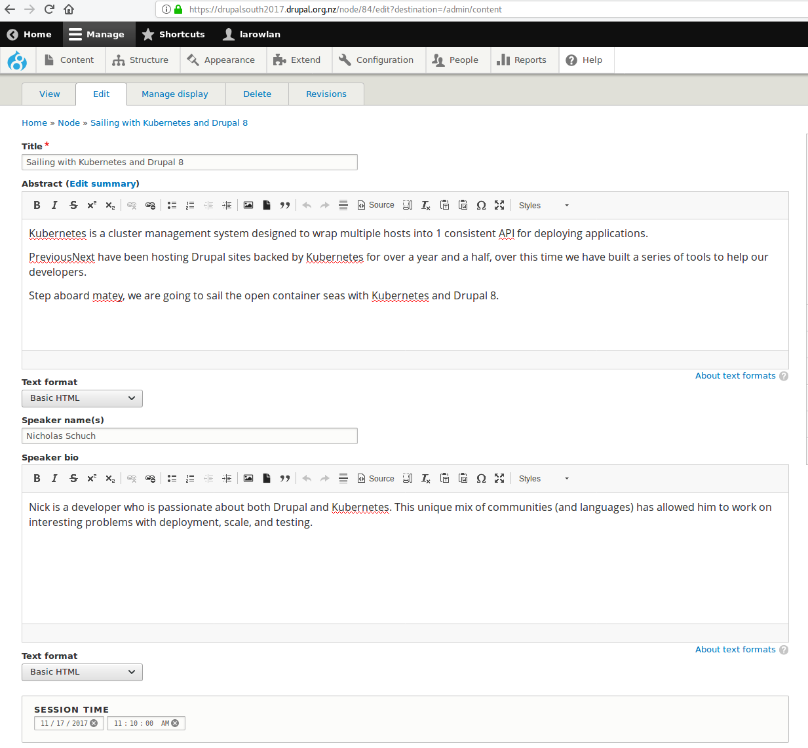

Note:
- gimmicky?
- drupal as canonical source
- omni-channel

---

## Terminology

Note:
- so let's go over some of the terminology we're going to cover

--

## Intents

Note:
- mapping what the user says into an action
- 'Order some pizza?'
- 'What is the wait time?'

--

## Entities

Note:
- familiar w/ from Drupal
- basically the same
- collection of objects
- synonyms

--

## Context

Note:
- conversation is threaded
- humans keep track
- 'play something by Kurt Vile'
- 'give me another one'

--

## Fulfillment

Note:
- Dynamic responses
- Where Drupal fits in

---

## Design considerations

Note:
- So conversation is hard
- You need to plan
- Nothing worse than poor UX/ rabbit holes

--

## You need to think about

- Scope
- Personality
- Flow

--

## Scope

Note:
- Make it clear what you can and can't do
- Avoid unrelated questions and dead-ends
- Good intro text

--

<!-- .slide: data-background="./images/twine.png" -->
## Mapping out the flow

- https://twinery.org/2/

Note:
- Use a flow charting tool 

--

## Start with the happy path

Note:
- User gets it straight away
- Typical flow

--

## Don't forget the unhappy path

Note:
- Add a 'help' if you get stuck
- Redirect them to other forms
- Start over

--

## Character

Note:
- Keep it interesting
- Make it fun
- Make it unique

---

## Dialogflow
(formerly api.ai) 
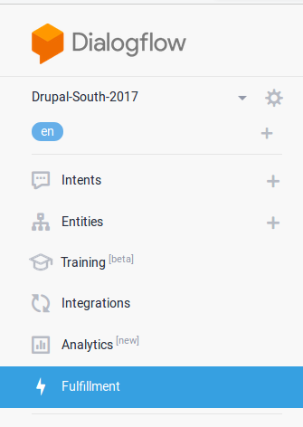

Note:
- tool of choice

--

## Your first intent

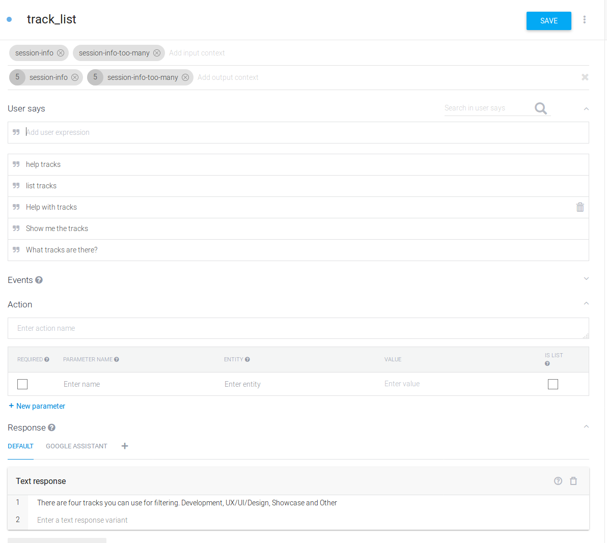

Note:
- User says
- Machine learning
- Enter 5-10 to seed it
- The more the better

--

## Creating some entities

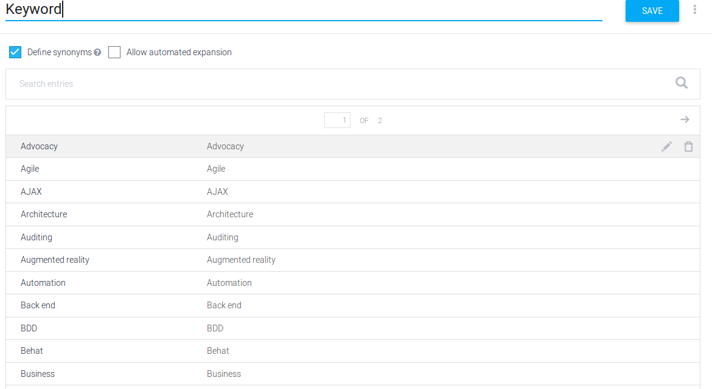

Note:
- Some are fixed
- Some are dynamic (more on that later)
- Synonyms are important

--

## Slots

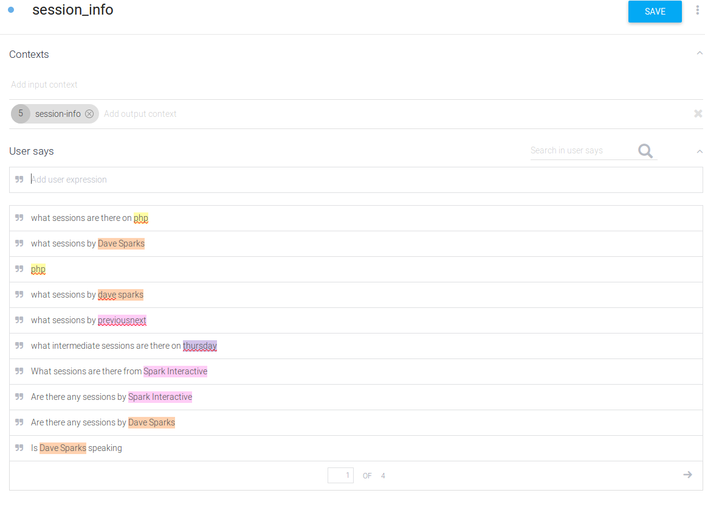

Note:
- Can be required
- Will prompt

--

## Slots

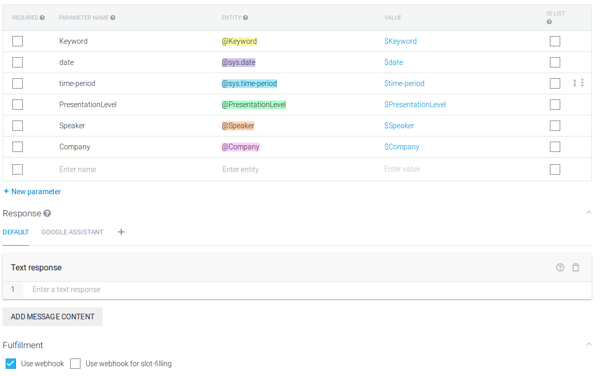

--

## Tracking context

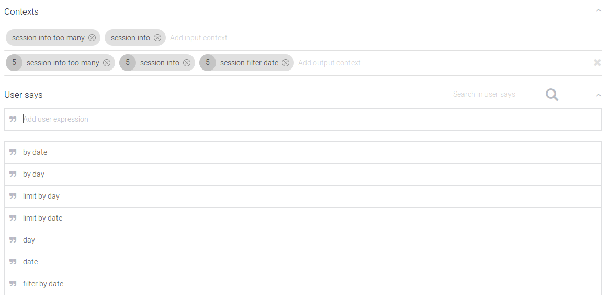

Note:
- Play a song by 'Beulah'
- Play another song
- Expiring context
- Requiring context

--

## Fulfillment with Drupal

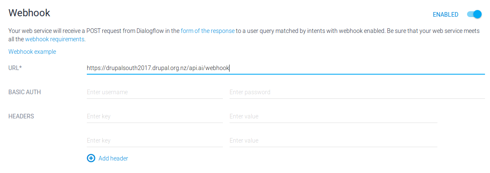

Note:
- Configure url
- configure password

--

## Integrations 

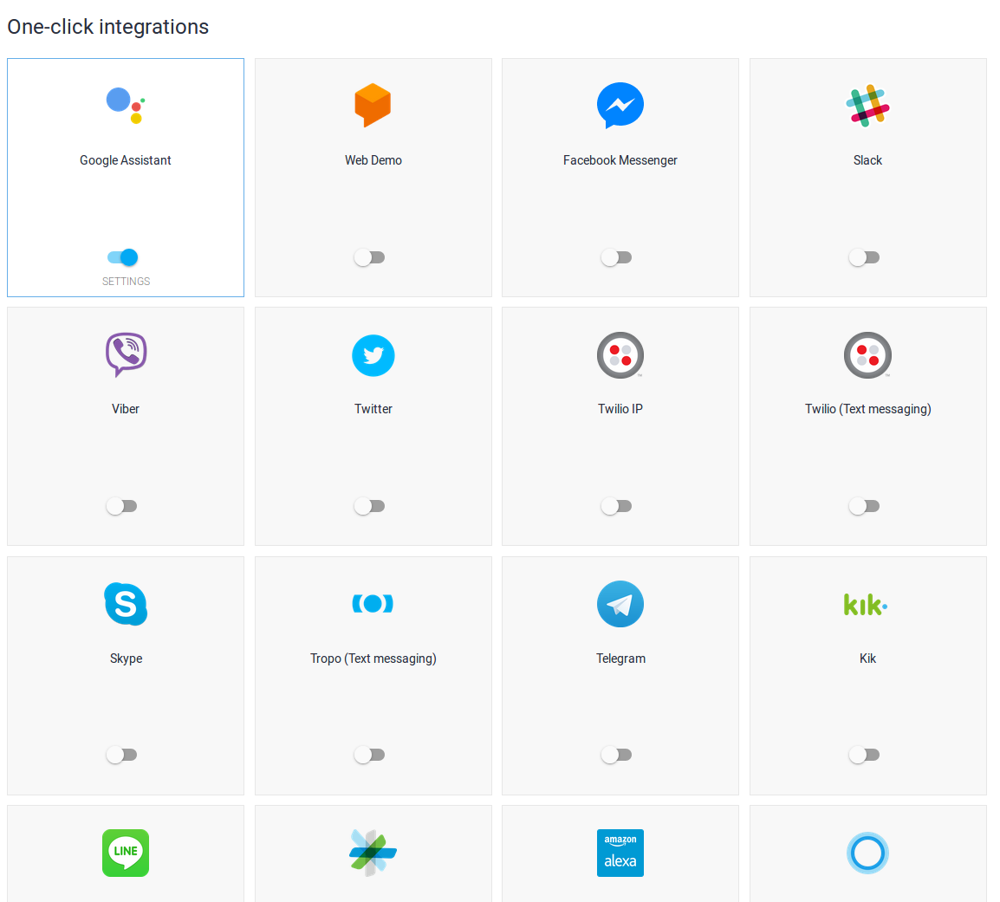

Note:
- Actions on google
- Raw JavaScript

--

## Training

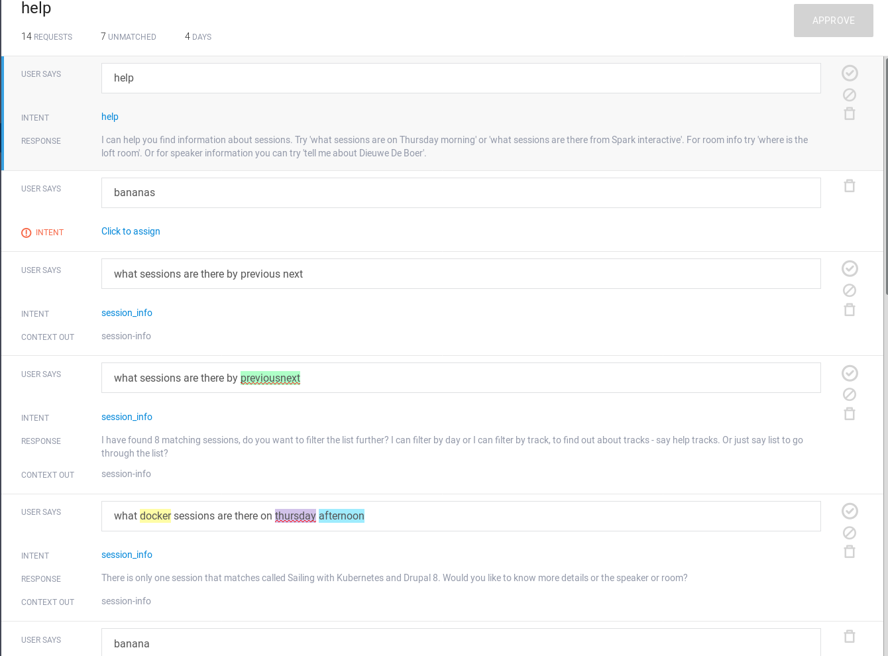

Note:
- When things go wrong

--

## Testing

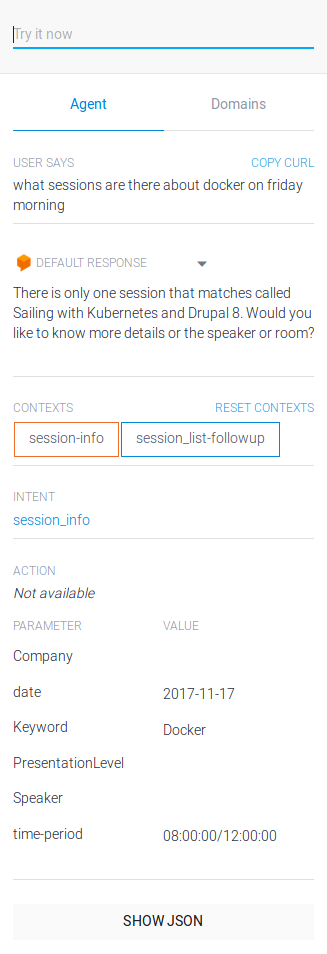

---

## Drupal

--

## Chatbot API

<code>drupal.org/project/chatbot_api</code>

--

## Dialogflow webhook

<code>drupal.org/project/api_ai_webhook</code>

--

## Intent plugins
(show me some code)

Note:
- https://github.com/previousnext/pnx-d8/blob/master/app/modules/custom/pnx_bot/src/Plugin/Chatbot/Intent/Blogs.php

--

<pre><code class="php">namespace Drupal\your_module\Plugin\Chatbot\Intent;

use Drupal\chatbot_api\Plugin\IntentPluginBase;
/**
 * @Intent(
 *   id = "speaker_info_cold",
 *   admin_label = @Translation("Speaker bio"),
 * )
 */
class SpeakerBio extends IntentPluginBase {
  
  public function process() {
    if ($speaker = $this->request->getIntentSlot('Speaker', FALSE)) {
      // Do something with $speaker.
      return $this->response->setIntentResponse(...);
    }
    $this->response->setIntentResponse(...);
  }
}
</code></pre>

--

## Pushing entities
(show me some site building) 
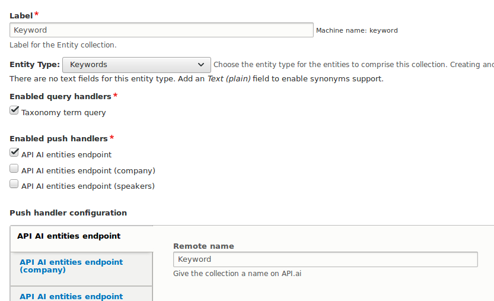

--

## Advanced pushing
(DIY query and push)

--

## Custom query

<pre><code class="php">
namespace Drupal\your_module\Plugin\ChatbotApiEntities\QueryHandler;

use Drupal\chatbot_api_entities\Entity\EntityCollectionInterface;
use Drupal\chatbot_api_entities\Plugin\QueryHandlerBase;
use Drupal\Core\Entity\EntityTypeManagerInterface;
/**
 * @QueryHandler(
 *   id = "speakers",
 *   label = @Translation("Query speakers from sessions"),
 * )
 */
class SpeakerQuery extends QueryHandlerBase {

  public function query(EntityTypeManagerInterface $entityTypeManager, array $existing = [], EntityCollectionInterface $collection) {
    // Logic that returns array of entities.
  }

  public function applies($entity_type_id) {
    return $entity_type_id === 'node';
  }
}
</code></pre>

--

## Custom push

<pre><code class="php">namespace Drupal\ds_akl_bot\Plugin\ChatbotApiEntities\PushHandler;

use Drupal\api_ai_webhook\Plugin\ChatbotApiEntities\PushHandler\ApiAiPushHandler;
use Drupal\chatbot_api_entities\Entity\EntityCollection;
use Drupal\Core\Entity\EntityInterface;
/**
 * @PushHandler(
 *   id = "api_ai_webhook_company",
 *   label = @Translation("API AI entities endpoint (company)")
 * )
 */
class CompanyPush extends ApiAiPushHandler {

  /**
   * {@inheritdoc}
   */
  protected function formatEntries(array $entities, EntityCollection $entityCollection) {
    // Get values from the entities as ['value' =>, 'synonyms' => []] pairs.
  }
}
</code></pre>

---

## Recap

* Demo
* Terminology
* Dialogflow
* Drupal

Note:
- Go out and make something cool

---

<!-- .slide: data-background="./images/turtle.jpg" -->

## Looping back

@larowlan

Let me know if you build something interesting

Note:
- Senior Drupal Developer with PNX
- QLD based

--

## Thanks

- The Drupal South Team
- Sparks Interactive
- Dieuwe De Boer
- @gambry

--

## Image credits

- https://flic.kr/p/73DhiT
- https://flic.kr/p/smA95B

--

## Questions
